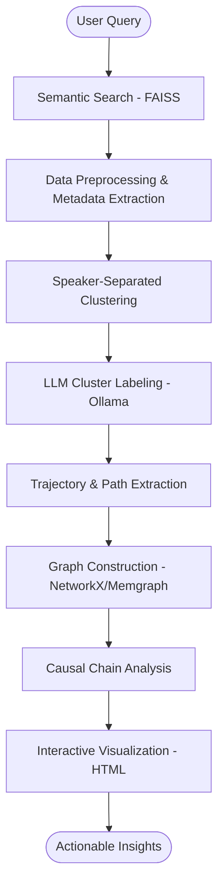

# System Architecture & Workflow

This document provides a high-level overview of the system architecture and the processing workflow for the Causal Analysis from Conversational Data project (Dialog2Flow).

## 🏗 System Architecture

The system is designed as a modular pipeline that processes raw conversational data into actionable insights through semantic analysis and graph-based modeling.

### 1. Data Layer
- **Input Data:** Annotated conversation datasets (JSON) containing utterances, speaker labels, and metadata (e.g., domain, intents, emotions).
- **Embeddings Store:** FAISS-based vector database storing semantic representations of conversations for rapid retrieval.
- **Graph Database:** Optional integration with **Memgraph** via Docker for persistent graph storage and advanced querying.

### 2. Processing Layer (The Pipeline)
- **Semantic Retriever:** Uses `SentenceTransformers` (`all-mpnet-base-v2`) and `FAISS` to find conversations relevant to user queries.
- **Data Cleaner & Preprocessor:** Normalizes data and preserves rich metadata (escalation levels, churn risk, empathy scores).
- **Clustering Engine:** Implements speaker-separated clustering (joint-BERT) to group similar Agent and Customer utterances independently.
- **Trajectory Extractor:** Maps raw utterances to their respective clusters to form "trajectories" representing the conversation flow.
- **LLM Handler:** Integrates with **Ollama** (e.g., Llama 3) to generate human-readable labels for each discovered cluster.

### 3. Analytics & Graph Layer
- **Graph Generator:** Constructs directed graphs (DiGraphs) using `NetworkX` where nodes are clusters and edges are transitions between states.
- **Causal Engine:** Identifies causal chains and relationship patterns within the extracted trajectories.
- **Query Handler:** Supports follow-up questions and contextual query reformatting via LLM.

### 4. Visualization Layer
- **Interactive Visualizer:** Generates interactive HTML/JS graphs using `mxGraph` or custom D3.js templates.
- **Metadata Tooltips:** Surfaces cluster statistics (empathy scores, intent distribution) directly on the graph interface.

---

## 🔄 Workflow Diagram

---

## 🛠 File-to-Function Mapping

| File | Responsibility |
| :--- | :--- |
| `main.py` | Pipeline entry point and orchestration. |
| `embedder.py` / `query_embeddings_db.py` | Embedding generation and vector search. |
| `data_cleaner.py` / `prepare_for_dialog2flow.py` | Data normalization and formatting for the clustering engine. |
| `extract_trajectories_with_metadata.py` | Clustering utterances and extracting flow paths. |
| `llm_handler.py` | Interface with Ollama for node labeling and query reformatting. |
| `graph_gen.py` / `build_graph_with_metadata.py` | Building the NetworkX graph and adding metadata properties. |
| `gen_causalsubgraph_json.py` | Extracting specific causal segments from the larger graph. |
| `visualize_causal_subgraph.py` | Rendering the final interactive HTML visualization. |

---

## 🚀 Step-by-Step Execution Flow

1. **Initialization:** The user provides a query and a domain (e.g., "flight", "banking").
2. **Retrieval:** The system searches the FAISS index to find the Top K (default: 20) most similar conversations.
3. **Clustering:** Utterances from these conversations are clustered using a distance threshold. Agent responses are clustered separately from Customer responses.
4. **Labeling:** For each cluster, the LLM analyzes a sample of utterances to produce a representative label (e.g., "Agent: Confirming Ticket Details").
5. **Graphing:** Transitions between these labeled clusters are tracked across all Top K conversations to build a directed graph.
6. **Persistence:** The results are saved to `ans.json` and various graph formats (`.graphml`, `.json`).
7. **Visualization:** An interactive HTML file is generated allowing the user to explore the conversation flows and hover over nodes to see metadata statistics.
